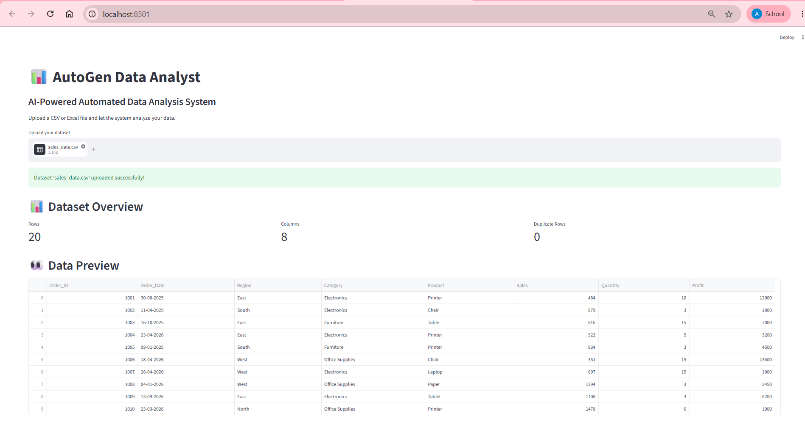

# 📊 AutoGen Data Analyst

An AI-powered automated data analysis platform that allows users to upload CSV or Excel datasets, perform data analysis and cleaning, ask questions using natural language, generate SQL queries, visualize results, and receive AI-powered business insights.

## 🚀 Features

- CSV and Excel dataset upload
- Automated data profiling
- Data quality analysis
- Missing-value detection
- Duplicate detection
- Statistical analysis
- KPI generation
- Outlier detection
- Natural Language Data Cleaning
- Natural Language Data Analysis
- AI-generated SQL queries
- Interactive data visualization
- AI-powered business insights
- Downloadable analysis reports
- Downloadable cleaned datasets

## 🛠️ Technologies

- Python
- Pandas
- SQL
- SQLite
- Streamlit
- Groq
- AutoGen
- Matplotlib

## 🎯 Purpose

The project combines traditional data analytics with Generative AI to help users analyze datasets without manually writing SQL queries or performing repetitive analysis tasks.

## 🏗️ Project Architecture

```text
CSV / Excel Dataset
        ↓
Streamlit Application
        ↓
Data Profiling & Quality Checks
        ↓
Pandas Data Processing
        ↓
Natural Language Query
        ↓
Groq LLM + AutoGen
        ↓
SQL Query Generation
        ↓
SQLite / Data Analysis
        ↓
Results & Visualizations
        ↓
AI-Powered Business Insights
## 🎯 Learning Outcomes

This project demonstrates practical experience in:

Python
SQL
Pandas
Data Cleaning
Data Quality
Statistical Analysis
Data Visualization
Generative AI
LLM Integration
AI Agents
Natural Language Analytics
Business Intelligence

## 🔐 Security

API keys are stored locally using environment variables and are not included in the repository.

## 🖥️ Application Screenshots

### 📊 Dashboard



### 🧪 Data Quality Analysis


### 🧹 Natural Language Data Cleaning


### 🤖 AI Data Analysis


## ▶️ How to Run

### 1. Clone the Repository

```bash
git clone https://github.com/AnitaThangam/autogen-data-analyst.git
cd autogen-data-analyst
```

### 2. Create a Virtual Environment

```bash
python -m venv .venv
```

Activate it on Windows:

```bash
.venv\Scripts\activate
```

### 3. Install Dependencies

```bash
pip install -r requirements.txt
```

### 4. Configure the API Key

Create a `.env` file in the project directory:

```text
GROQ_API_KEY=your_groq_api_key
```

Replace `your_groq_api_key` with your own Groq API key.

**Never upload the `.env` file or your API key to GitHub.**

### 5. Run the Application

```bash
python -m streamlit run app.py
```

The application will open in your browser.

### 6. Upload a Dataset

Upload a CSV or Excel file and use the available features for:

* Data profiling
* Data quality analysis
* Outlier detection
* Natural language data cleaning
* Natural language data analysis
* AI-powered insights

